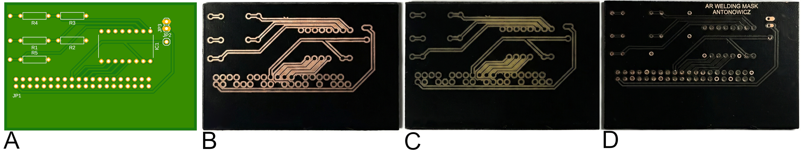
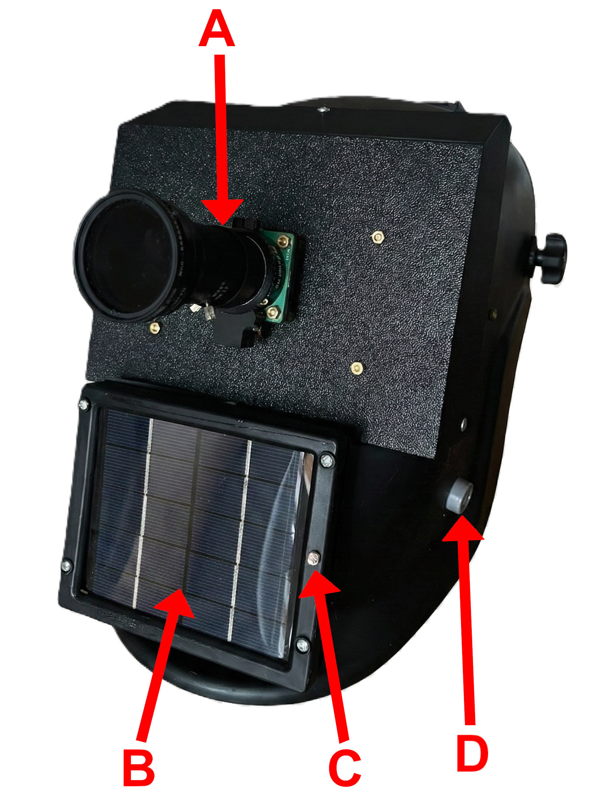
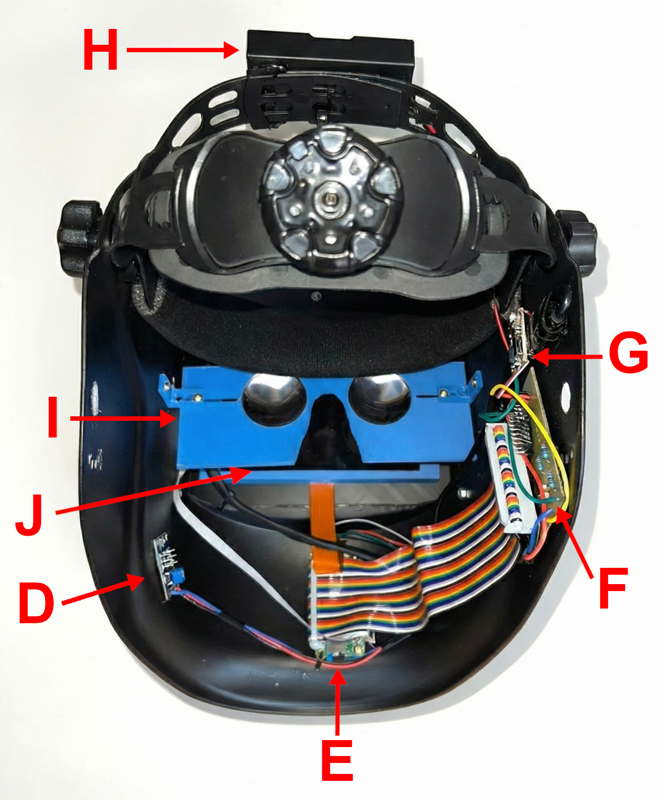

# 🛡️ AR Welding Helmet
### Welding Helmet with Augmented Reality (AR) Supporting Electric Arc Welding


## 📖 Abstract
**Bachelor's Thesis Project**

The aim of this project was to design and construct a welding helmet utilizing **Augmented Reality (AR)** technology in **Video Pass-Through** mode. The system eliminates the risk of flash blindness by replacing the traditional optical path with a digital vision system using a **Global Shutter camera**.

The device features a custom-made PCB, a hybrid power supply with **Energy Harvesting** (solar panel), and environmental sensors (gas, light). The software runs on a **Raspberry Pi Zero 2 W**, utilizing direct framebuffer access to achieve low-latency stereoscopic vision.

---

## ⚙️ Hardware Architecture

### Core Components
* **SBC:** Raspberry Pi Zero 2 W
* **Camera:** Raspberry Pi Global Shutter Camera (Sony IMX296) + ND 2-1000 Filter
* **Display:** 5.5" HDMI AMOLED (1920x1080)
* **ADC:** MCP3008 (SPI interface)

### Sensors & Power
* **Gas Sensor:** MQ-07 (Carbon Monoxide)
* **Light Sensor:** Photoresistor (Trigger for AGC)
* **Energy Harvesting:** Polycrystalline Solar Panel
* **Power:** Li-Ion 18650 Cells + BMS

### Custom PCB
The motherboard was designed in **KiCad / Fusion 360** and manufactured using a custom **laser ablation method** combined with chemical etching.



---

## 🛠️ Software & Algorithms

The control software is written in **Python** and optimized for the limited resources of the RPi Zero 2 W.

* **Direct Framebuffer Access:** Writing directly to `/dev/fb0` to bypass X11 overhead and minimize latency.
* **Adaptive Exposure Control (AEC):** Custom PID-like algorithm to adjust exposure time and gain in <100ms during arc ignition.
* **Multithreading:** Separated threads for image capture, data processing, and HUD rendering.
* **Stereoscopy:** Split-screen side-by-side rendering for VR optics compatibility.

### Dependencies
```text
opencv-python-headless
picamera2
spidev
numpy
```

## 📸 Gallery & Demo

### 1. The Prototype
The physical construction integrates standard welding protection with custom digital systems. The layout of the components is designed for optimal weight distribution and sensor accuracy.

| **Front View (External Sensors)** | **Internal Electronics & Optics** |
| :---: | :---: |
|  |  |

#### **Component Legend:**

**Front Panel (External):**
* **A) Camera Optical Assembly:** Raspberry Pi Global Shutter camera with UV protection and adjustable ND 2-1000 filter.
* **B) Solar Panel:** Polycrystalline silicon cell for Energy Harvesting.
* **C) Photoresistor:** Light intensity sensor acting as a trigger for exposure control algorithms.
* **D) MQ-07 Gas Sensor:** Carbon Monoxide monitoring inlet.

**Internal Layout:**
* **E) Central Processing Unit:** Raspberry Pi Zero 2 W.
* **F) Custom PCB:** Motherboard with integrated ADC, manufactured via laser ablation.
* **G) Power Management (BMS):** Module for energy distribution and solar charging control.
* **H) Energy Storage:** High-capacity Li-Ion 18650 battery pack.
* **I) VR Lens Assembly:** Biconvex lenses for comfortable eye accommodation at close display proximity.
* **J) 5.5" LCD Display:** Full HD panel responsible for rendering the AR HUD interface.

---

### 2. AR HUD Interface (Scenarios)
Visualization of the real-time data overlaid on the welder's field of view.

| **Welding Arc (Active AGC)** | **Gas Alarm (Safety Warning)** |
| :---: | :---: |
|  |  |

### 3. Video Demonstration
Click the thumbnail below to watch the system in action on YouTube:

[](https://www.youtube.com/watch?v=YOUR_VIDEO_ID_HERE)

> **Note:** If the YouTube link is unavailable, you can find the raw video file in the repository at: `media/video/demo.mp4`.

---

## 🏗️ Mechanical Design

The entire mechanical structure, including electronics enclosures and custom mounts, was designed in **Autodesk Fusion 360**. All components were optimized for 3D printing using **PET-G** and **PLA** filaments.


---

## 📄 License & Information

This project is open-source and available under the **MIT License**.

* **Author:** Jakub Antonowicz
* **University:** Silesian University of Technology (*Politechnika Śląska*)
* **Year:** 2026

---
